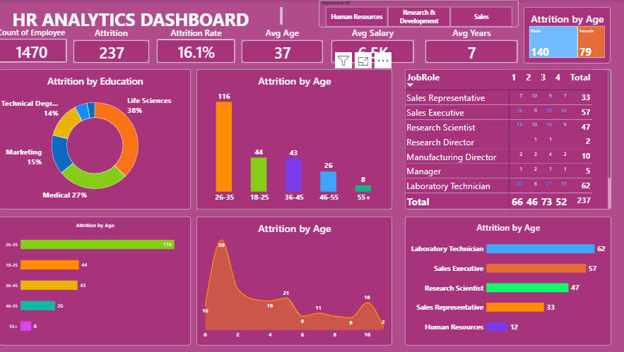

## Dashboard Preview

# HR Analytics Dashboard

## Dashboard Preview

  

## Project Overview

The HR Analytics Dashboard is an interactive Power BI solution designed to analyze employee attrition, workforce demographics, job roles, salary distribution, and employee performance metrics. The dashboard helps HR professionals identify key workforce trends and make data-driven decisions to improve employee retention and organizational efficiency.

## Key Performance Indicators (KPIs)

- Total Employees: 1470
- Attrition Count: 237
- Attrition Rate: 16.1%
- Average Employee Age: 37 Years
- Average Salary: 6.5K
- Average Working Years: 7

## Key Insights

- Highest attrition was observed in the 26–35 age group.
- Life Sciences employees contributed the largest share of attrition.
- Laboratory Technicians showed the highest attrition among job roles.
- Attrition trends vary across departments and employee demographics.
- Employee age and job role have a significant impact on retention.

## Dashboard Features

- Employee Attrition Analysis
- Education-wise Attrition Distribution
- Age Group Analysis
- Department-wise Workforce Analysis
- Job Role Performance Tracking
- Interactive Slicers and Filters
- Dynamic KPI Cards

## Tools & Technologies

- Power BI Desktop
- Power Query
- DAX (Data Analysis Expressions)
- Microsoft Excel

## Skills Demonstrated

- Data Cleaning
- Data Transformation
- Data Modeling
- DAX Measures
- Data Visualization
- Business Intelligence
- HR Analytics

## Business Impact

This dashboard enables HR teams to identify workforce challenges, monitor attrition trends, improve employee retention strategies, and support data-driven human resource planning.

## Author

**Bhawana**

Aspiring Data Analyst | Power BI Developer | SQL | Excel | Data Visualization

# HR-Analytics-Dashboard - https://github.com/bulbulmishra591995-rgb/HR-Analytics-Dashboard

